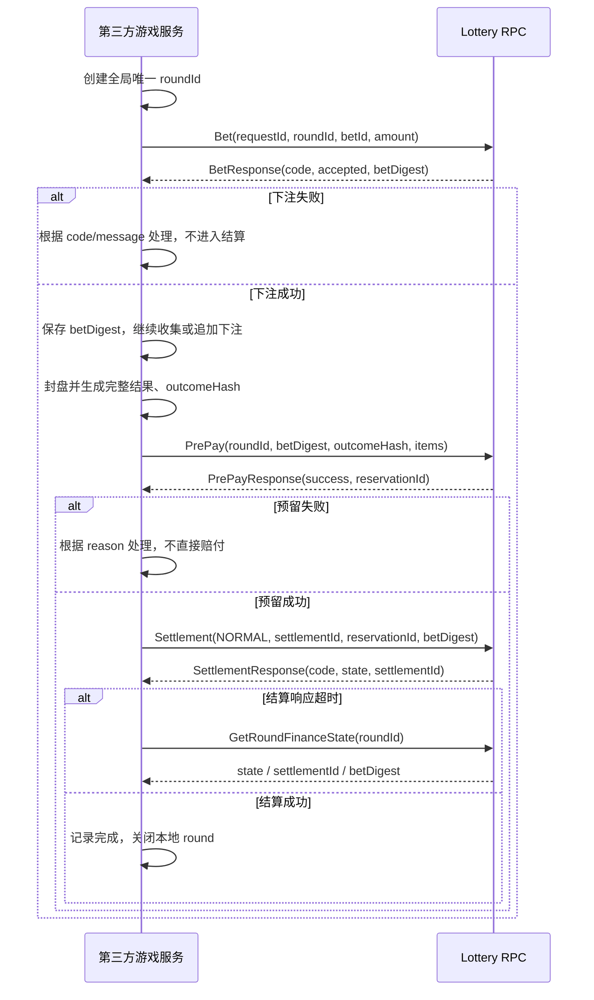
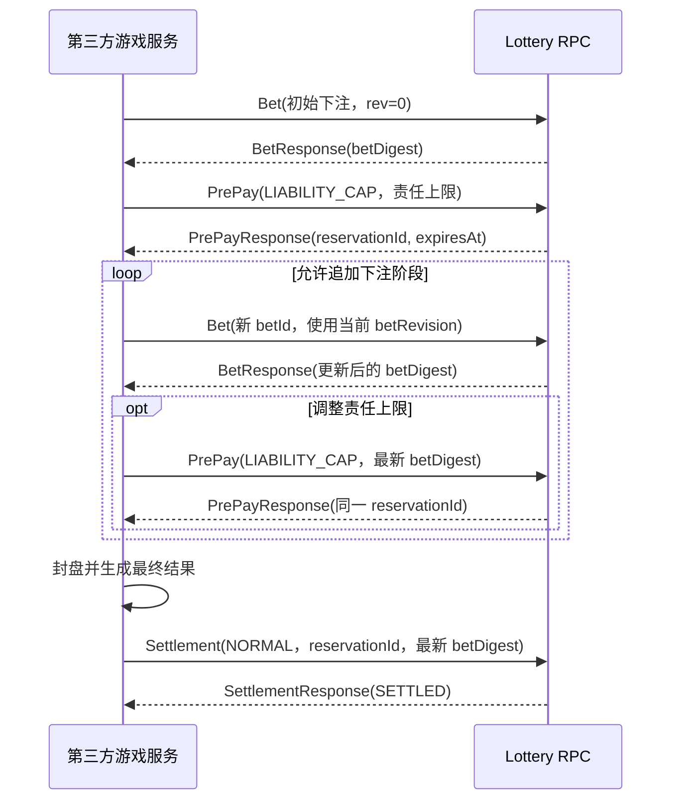
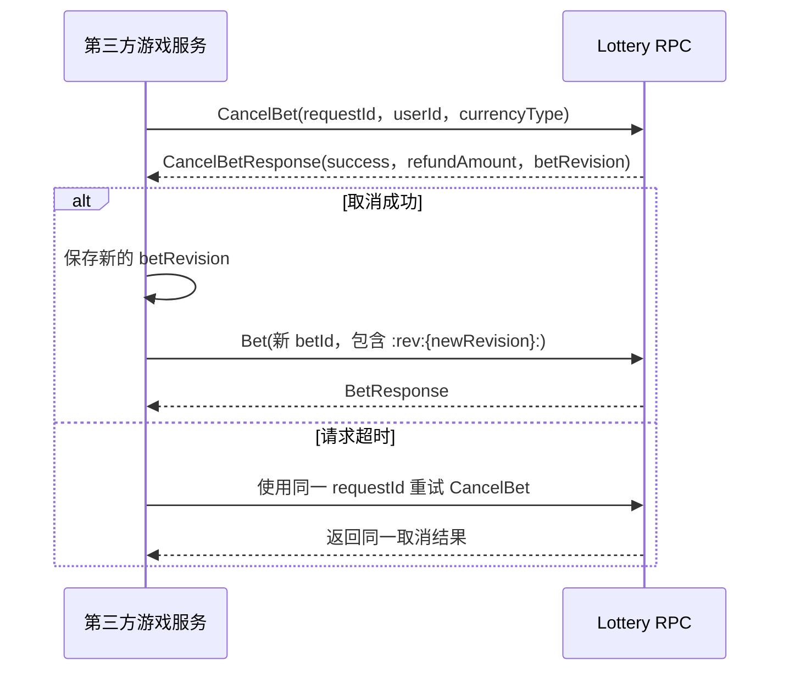
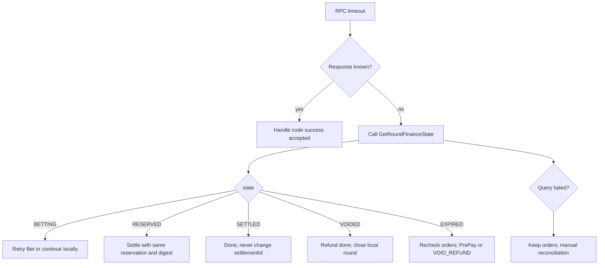
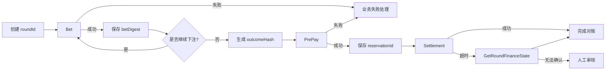

# Lottery RPC 第三方接入文档

## 1. 文档说明

本文面向外部游戏服务、第三方游戏厂商和接入网关，说明如何调用统一资金服务 `lottery.LotteryService`。

本文只描述第三方需要遵守的接口契约，不描述 Lottery 内部实现、数据库、Redis、奖池算法或异步落地流程。内部架构和实现边界请参阅：[项目架构与 RPC/Lottery 详细报告](./项目架构与RPC-Lottery详细报告.md)。

Lottery 不负责生成开奖结果。第三方游戏服务负责游戏规则、下注合法性、结果生成、结果摘要和游戏记录；Lottery 负责玩家资金扣除、返还、退款及资金状态确认。

## 2. 接入信息

### 2.1 服务地址

开发环境可使用：

```text
127.0.0.1:10080
```

生产环境请通过接入方网关或服务发现获取 Lottery 节点。服务注册名称为 `wg-lottery`，注册路径格式为：

```text
/grpc/registry/wg-lottery/wg-lottery-*
```

第三方不应将某个固定 IP 永久写死，应实现节点失效重连和连接池管理。当前服务使用 gRPC 明文连接，生产环境必须通过受信任的内网或网关访问。

### 2.2 协议文件

```text
micro_service/proto/lottery.proto
micro_service/proto/base.proto
```

Go 调用方可直接使用 `micro_service/services/lottery_grpc.pb.go` 和 `lottery.pb.go`。其他语言请使用标准 `protoc` 根据 proto 文件生成客户端。

### 2.3 建立连接

Go 示例：

```go
conn, err := grpc.NewClient(
    "10.0.0.10:10080",
    grpc.WithTransportCredentials(insecure.NewCredentials()),
)
if err != nil { return err }
defer conn.Close()
client := services.NewLotteryServiceClient(conn)
```

每次 RPC 都应设置超时。建议普通请求使用 3 秒左右，具体值由业务 SLA 决定。

## 3. 第三方必须遵守的约定

### 3.1 标识字段

| 字段 | 第三方要求 |
| --- | --- |
| `roundId` | 每一局生成一个全局唯一值；整局生命周期内保持不变 |
| `betId` | 每笔下注唯一；同一局内不能复用 |
| `requestId` | 每次请求生成唯一值；超时重试时按接口要求复用或重新生成 |
| `betDigest` | 始终使用 Lottery 最近一次响应返回的值 |
| `outcomeHash` | 由第三方对完整候选/最终结果生成的摘要；同一结果必须稳定 |
| `reservationId` | 由 PrePay 返回；Settlement 时原样带回 |
| `settlementId` | 一次最终结算使用一个值；结算超时重试必须复用 |

`roundId` 不能在不同代理、游戏或房间等级之间复用。Lottery 会校验这些路由信息的一致性。

### 3.2 金额字段

- 所有金额使用十进制字符串，不要传二进制浮点格式化结果。
- 金额最多保留两位小数，例如 `10`、`10.00`、`0.50`。
- 下注、赔付和抽水不能为负数。
- `profit` 可以为负数，但必须等于 `payout - betAmount`。
- `currencyType` 使用双方约定的币种代码，例如 `CNY`。
- 不要在第三方侧自行换算 CNY；请求中传玩家原币种金额。

### 3.3 响应判断

调用方必须同时检查 gRPC transport error、响应中的 `code`、`accepted/success` 以及 `reason/message`。业务失败通常不会以 gRPC error 返回；gRPC 调用成功不代表下注或结算成功。

## 4. 推荐业务时序

### 4.1 标准游戏

```text
创建 roundId
  -> Bet（可调用一次或多次）
  -> 游戏封盘并生成结果
  -> PrePay
  -> Settlement(mode=NORMAL)
  -> 可选：GetRoundFinanceState 确认最终结果
```

### 4.2 责任上限玩法

```text
Bet
  -> PrePay(reservationMode=LIABILITY_CAP)
  -> 允许继续 Bet
  -> 游戏结束
  -> Settlement(mode=NORMAL)
```

### 4.3 故障退款

```text
GetRoundFinanceState
  -> 第三方核对本地订单和玩家列表
  -> Settlement(mode=VOID_REFUND)
  -> GetRoundFinanceState 确认结果
```

无法确认资金结果时，不要创建新的结算编号进行盲目重试，应先查询牌局状态并联系平台方处理。

## 5. 对接流程图

### 5.1 标准下注与结算



### 5.2 责任上限玩法



责任上限模式下，追加下注必须使用最新的 `betRevision` 生成 `betId`，最终结算必须使用最新 `betDigest`。如果转换为普通精确预留，转换完成后不要再追加下注。

### 5.3 CancelBet 与重新下注



同一 `requestId` 不得更换玩家或币种。取消成功后不能复用旧 revision 的 `betId`。

### 5.4 超时与故障恢复决策



图中英文节点与业务含义对应如下：`BETTING` 表示可以根据本地订单决定是否重试下注；`RESERVED` 表示继续使用原 `reservationId` 和最新 `betDigest` 结算；`SETTLED`/`VOIDED` 分别表示结算/退款已完成；`EXPIRED` 需要重新预赔或执行整局退款。查询仍失败时，保留本地订单并进入人工对账，不要盲目退款。

### 5.5 第三方调用决策总览



## 6. Bet 接口

### 6.1 用途

扣除玩家余额并登记一笔或多笔下注。一次请求可携带多个玩家的下注，但批量请求不是全量事务：已成功的 item 不会因其他 item 失败而自动回滚。

### 6.2 请求

```text
BetRequest {
  requestId: string
  roundId: string
  gameId: uint32
  agent: uint32
  level: uint32
  items: BetItem[]
}

BetItem {
  betId: string
  userId: uint32
  currencyType: string
  amount: string
  areaId: string
}
```

`betId` 必须包含格式 `:rev:{n}:`。首次下注通常使用 revision `0`；收到 CancelBet 成功响应后，后续下注必须使用响应中的新 `betRevision`。

### 6.3 响应

```text
BetResponse {
  code: error_code
  roundId: string
  state: string
  betDigest: string
  items: BetItemResult[]
}

BetItemResult {
  betId: string
  userId: uint32
  code: error_code
  accepted: bool
  currency: string
  message: string
}
```

只有 `code=OK` 且 item `accepted=true` 才表示该笔下注成功。请保存响应中的 `betDigest`，后续 PrePay、Settlement 和 CancelBet 校验时使用。

`state` 可能为 `BETTING`、`RESERVED`、`SETTLED`、`VOIDED` 或 `EXPIRED`。第三方通常只需关注：`SETTLED` 表示正常结算完成，`VOIDED` 表示整局退款完成，`EXPIRED` 需要进一步核对是否执行退款。

### 6.4 Bet 重试

网络超时后，使用原 `roundId + betId` 查询/重试，不要立即生成新 betId。相同 `roundId + betId` 会返回原下注结果，不应重复扣款。

## 7. betDigest 使用方式

第三方应始终使用 Lottery 响应返回的 `betDigest`，不要根据本地订单自行推算作为唯一依据。

以下规则仅用于联调排查：Lottery 摘要覆盖当前全部成功且未取消的下注，按 `betId` 排序后计算 SHA-256。任何追加下注或取消下注都会导致摘要变化。

如果收到 `BET_MISMATCH`：

1. 调用 `GetRoundFinanceState` 获取当前摘要；
2. 对比本地有效下注集合；
3. 使用最新摘要重新发起 PrePay/Settlement。

## 8. PrePay 接口

### 8.1 用途

在最终结算前提交预计返还金额，确保牌局具备可赔付条件。

### 8.2 请求

```text
PrePayRequest {
  requestId: string
  roundId: string
  gameId: uint32
  agent: uint32
  level: uint32
  betDigest: string
  outcomeHash: string
  timeoutSeconds: uint32
  items: PrePayItem[]
  reservationMode: string
}

PrePayItem {
  userId: uint32
  currencyType: string
  payout: string
}
```

要求：`betDigest` 必须是当前最新值；`outcomeHash` 必须非空；`items` 必须完整覆盖本局所有有效下注账户；同一 `userId + currencyType` 只能出现一次；`payout` 是该账户总返还，不是净利润；`timeoutSeconds=0` 使用平台默认值；责任上限场景使用 `LIABILITY_CAP`。

### 8.3 响应

```text
PrePayResponse {
  code: error_code
  success: bool
  roundId: string
  state: string
  reservationId: string
  totalPayoutCny: string
  expiresAt: int64
  reason: string
  betDigest: string
  outcomeHash: string
  reservationMode: string
}
```

只有 `code=OK` 且 `success=true` 才能继续最终结算。保存 `reservationId`、`betDigest` 和 `outcomeHash`。

### 8.4 PrePay 重试

超时重试时使用同一牌局的最新 `betDigest`；普通预留使用同一 `outcomeHash`；不要随意更换结果摘要或赔付明细；返回 `ROUND_CONFLICT` 时先查询状态，不要覆盖已有结果。

## 9. Settlement 接口

### 9.1 用途

完成最终赔付，或在故障场景对整局下注执行退款。

### 9.2 请求

```text
SettlementRequest {
  settlementId: string
  roundId: string
  gameId: uint32
  agent: uint32
  level: uint32
  reservationId: string
  betDigest: string
  outcomeHash: string
  mode: string
  items: SettlementItem[]
}

SettlementItem {
  userId: uint32
  currencyType: string
  betAmount: string
  payout: string
  profit: string
  record: string
  pump: string
}
```

要求：`settlementId` 非空且同一次结算重试保持不变；`betDigest` 使用最新值；`items` 完整覆盖所有有效下注账户；`betAmount` 等于该账户本局下注总额；`profit = payout - betAmount`；`pump` 不得为负数；`record` 由第三方传入完整游戏记录；`mode` 为空或 `NORMAL` 表示正常赔付，`VOID_REFUND` 表示整局退款。

### 9.3 NORMAL 正常结算

有 PrePay 结果时，必须携带对应的 `reservationId`。普通预留必须使用相同的 `outcomeHash`；责任上限模式按双方约定可使用最终结果摘要。最终 `payout` 不得超过已确认的预赔范围。

### 9.4 VOID_REFUND 整局退款

仅用于整局退款，当前不支持部分退款：每个账户 `payout` 等于 `betAmount`、`profit` 为 `0`、`pump` 为 `0`；如果存在预留，必须带正确的 `reservationId`；第三方必须覆盖全部有效下注账户。

### 9.5 响应

```text
SettlementResponse {
  code: error_code
  roundId: string
  state: string
  settlementId: string
  items: SettlementItemResult[]
}

SettlementItemResult {
  userId: uint32
  code: error_code
  currency: string
  message: string
}
```

只有响应 `code=OK` 才能认为请求整体被接受；仍应检查每个 item 的 `code`。相同 `settlementId` 重试必须复用该编号。

## 10. GetRoundFinanceState 接口

### 10.1 用途

用于 RPC 超时确认、服务重启后的订单核对、结算前校验和人工审核。

### 10.2 请求和响应

```text
GetRoundFinanceStateReq { roundId: string }

GetRoundFinanceStateResp {
  code: error_code
  roundId: string
  state: string
  betDigest: string
  reservationId: string
  outcomeHash: string
  expiresAt: int64
  settlementId: string
  totalBetCny: string
  totalReservedCny: string
  reservationMode: string
  reservedItems: PrePayItem[]
  betRevision: int64
}
```

重点关注 `state`、`betDigest`、`reservationId`、`settlementId` 和 `betRevision`。当前 `reservedItems` 可能为空，不能依赖该字段获取预留明细。

## 11. CancelBet 接口

### 11.1 用途

取消指定玩家在当前牌局中的全部有效下注。该接口适用于双方确认支持的百人类玩法，不应替代整局 `VOID_REFUND`。

### 11.2 请求和响应

```text
CancelBetRequest {
  requestId: string
  roundId: string
  gameId: uint32
  agent: uint32
  level: uint32
  userId: uint32
  currencyType: string
  expectedBetDigest: string
}

CancelBetResponse {
  code: error_code
  success: bool
  refundAmount: string
  currency: string
  betDigest: string
  betRevision: int64
  canceledBetIds: string[]
  roundId: string
  state: string
  reason: string
}
```

`expectedBetDigest` 可选，但建议传入。成功后保存新的 `betRevision`；同一牌局再次下注时，新的 betId 必须带新 revision。相同 `requestId` 重试必须使用同一玩家和币种；更换玩家或币种会被视为请求冲突。

## 12. 错误码与处理建议

| 错误码/原因 | 第三方处理 |
| --- | --- |
| `GAME_FROZEN` | 停止该游戏的新下注，等待平台恢复 |
| `AGENT_FROZEN` | 停止该代理的新下注，联系平台确认 |
| `NO_ENOUGH_MONEY` | 该玩家下注失败，不要重复扣款重试 |
| `NO_ENOUGH_POOL_MONEY` | 进入业务异常或调整玩法结果，不能绕过资金校验 |
| `PARAMS_INVALID` | 修正请求字段或牌局状态后再试 |
| `ROUND_NOT_FOUND` | 检查 roundId；不要直接新建结算请求 |
| `BET_MISMATCH` | 先查询最新 betDigest，再重建请求 |
| `ROUND_CONFLICT` | 不覆盖已有预留/结算结果，转查询或人工处理 |
| `CANCEL_PENDING` | 等待取消请求恢复完成，不要并发下注或结算 |
| `SYSTEM_ERROR` | 按平台约定重试；涉及资金结果时先查询状态 |

## 13. 超时、重试和对账原则

1. Bet 超时：原 `roundId + betId` 重试或先查询，不生成新 betId 盲目重扣。
2. PrePay 超时：使用最新摘要和原结果摘要重试。
3. Settlement 超时：必须复用原 `settlementId`，重试前可先查询牌局。
4. CancelBet 超时：复用原 `requestId`，不得改用新 requestId 造成重复退款风险。
5. 任何资金请求都不要根据客户端超时直接判断为失败或成功。
6. 第三方必须保留本地下注、响应、重试和最终结算日志。

建议至少记录：

```text
roundId, betId, requestId, betDigest, outcomeHash,
reservationId, settlementId, betRevision, userId, currencyType
```

## 14. 联调验收清单

- [ ] 能够连接 Lottery gRPC 服务并处理节点重连。
- [ ] 所有金额使用十进制字符串，精度不超过两位小数。
- [ ] `roundId`、`betId`、`requestId`、`settlementId` 具备稳定生成策略。
- [ ] Bet 响应逐项检查 `accepted` 和 `code`。
- [ ] 后续请求使用最新 `betDigest`。
- [ ] PrePay 的账户集合完整且不重复。
- [ ] Settlement 的 `betAmount`、`payout`、`profit` 关系正确。
- [ ] 能正确区分 NORMAL 和 VOID_REFUND。
- [ ] RPC 超时能够查询牌局，而不是直接判定资金失败。
- [ ] 结算重试复用同一 `settlementId`。
- [ ] CancelBet 重试复用同一 `requestId`，并能处理 `betRevision`。
- [ ] 已完成正常结算、整局退款、余额不足、摘要不匹配和重复请求联调场景。

## 15. Go 最小示例

```go
ctx, cancel := context.WithTimeout(context.Background(), 3*time.Second)
defer cancel()

roundID := "bjl-20260828-000001"
betResp, err := client.Bet(ctx, &services.BetRequest{
    RequestId: "req-bet-001", RoundId: roundID, GameId: 1001,
    Agent: 12, Level: 2,
    Items: []*services.BetItem{{
        BetId: roundID + ":101:rev:0:bet-001", UserId: 101,
        CurrencyType: "CNY", Amount: "10.00", AreaId: "banker",
    }},
})
if err != nil || betResp.Code != services.ErrorCode_OK ||
    len(betResp.Items) != 1 || !betResp.Items[0].Accepted {
    return err
}

preResp, err := client.PrePay(ctx, &services.PrePayRequest{
    RequestId: "req-pre-001", RoundId: roundID, GameId: 1001,
    Agent: 12, Level: 2, BetDigest: betResp.BetDigest,
    OutcomeHash: "sha256-of-complete-result",
    Items: []*services.PrePayItem{{UserId: 101, CurrencyType: "CNY", Payout: "19.00"}},
})
if err != nil || preResp.Code != services.ErrorCode_OK || !preResp.Success {
    return err
}

setResp, err := client.Settlement(ctx, &services.SettlementRequest{
    SettlementId: "settle-20260828-000001", RoundId: roundID,
    GameId: 1001, Agent: 12, Level: 2,
    ReservationId: preResp.ReservationId, BetDigest: preResp.BetDigest,
    OutcomeHash: preResp.OutcomeHash, Mode: "NORMAL",
    Items: []*services.SettlementItem{{
        UserId: 101, CurrencyType: "CNY", BetAmount: "10.00",
        Payout: "19.00", Profit: "9.00", Pump: "0.00",
        Record: `{"winner":"banker"}`,
    }},
})
if err != nil || setResp.Code != services.ErrorCode_OK {
    // 使用相同 settlementId 查询/重试
    return err
}
```
